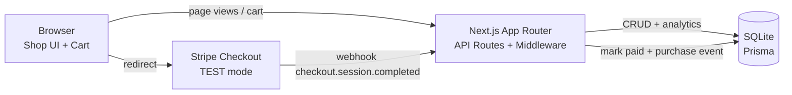
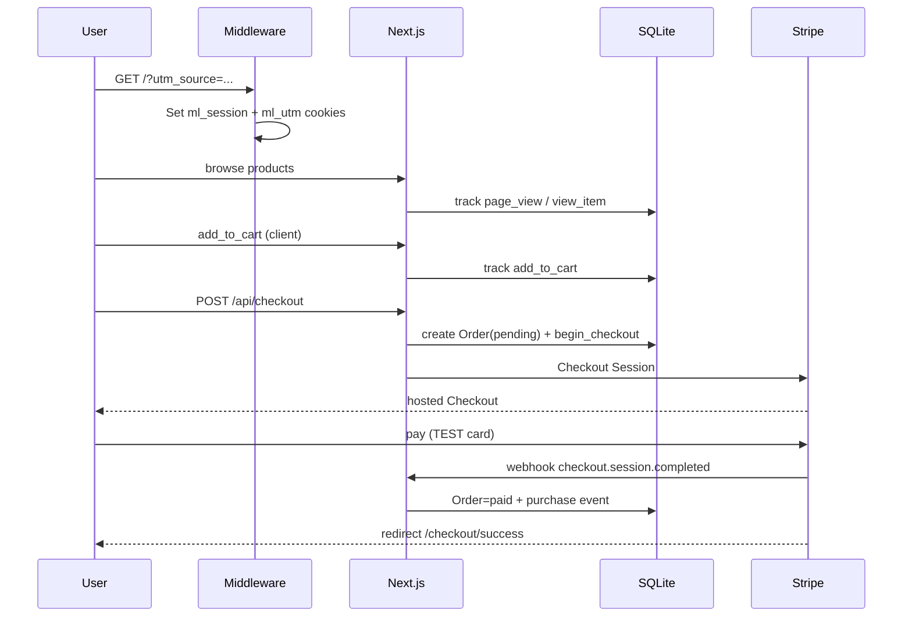
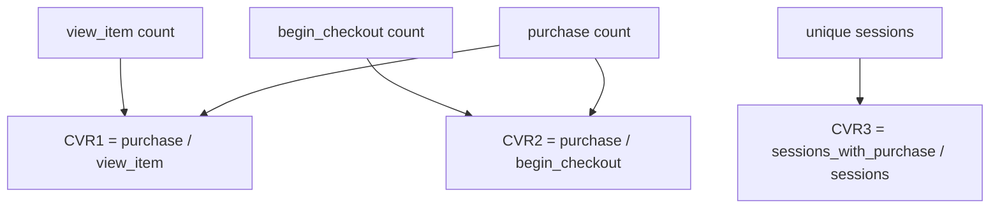

# Architecture — Marketing Lab EC

学習用デモショップのシステム構成とファネル計測の考え方。

## なぜ SQLite（v1）か

| 理由 | 説明 |
|------|------|
| ゼロ設定 | Postgres コンテナやクラウド DB なしで `file:./dev.db` だけで動く |
| 学習コスト | Prisma migrate / seed / Studio を最短で体験できる |
| 可搬性 | リポジトリを clone して即ローカル実験（マーケ計測の実験台） |
| 十分性 | デモ規模（商品数個・イベント数千件）では十分。本番規模は Postgres へ差し替え想定 |

v1 は「ファネル・CVR・Webhook・Checkout」の理解が目的。接続文字列を変えれば Prisma 経由で Postgres に移行可能。

## コンポーネント概要

## 閲覧 → 購入フロー

## ファーストパーティ計測

イベント種別: `page_view` | `view_item` | `add_to_cart` | `begin_checkout` | `purchase`

各イベントに付与:

- `sessionId`（cookie `ml_session`）
- `productId?` / `value?` / `currency?` / `path?` / `userAgent?`
- `utm_*`（cookie `ml_utm`、クエリから Middleware が保存）
- `createdAt`

注文（`Order`）にも同じ UTM をスナップショットし、Webhook 由来の `purchase` に引き継ぐ。

## CVR 計算式（管理画面・直近7日）

数式:

- **view_item → purchase** = `count(purchase) / count(view_item)`
- **begin_checkout → purchase** = `count(purchase) / count(begin_checkout)`
- **sessions → purchase** = `unique(sessionId where type=purchase) / unique(sessionId)`

分母が 0 のときは `—` 表示。

## 主要ルート

| Path | 役割 |
|------|------|
| `/` | 商品一覧 |
| `/products/[slug]` | 詳細 + view_item |
| `/cart` | カート → Checkout Session |
| `/checkout/success` | 完了（カートクリア） |
| `/checkout/cancel` | キャンセル |
| `/admin` | パスワード保護ダッシュボード |
| `/api/analytics` | イベント POST |
| `/api/checkout` | Stripe Session 作成 |
| `/api/webhook/stripe` | 支払完了 → paid + purchase |

## 環境変数

`.env.example` を参照。シークレットはコミット禁止。
